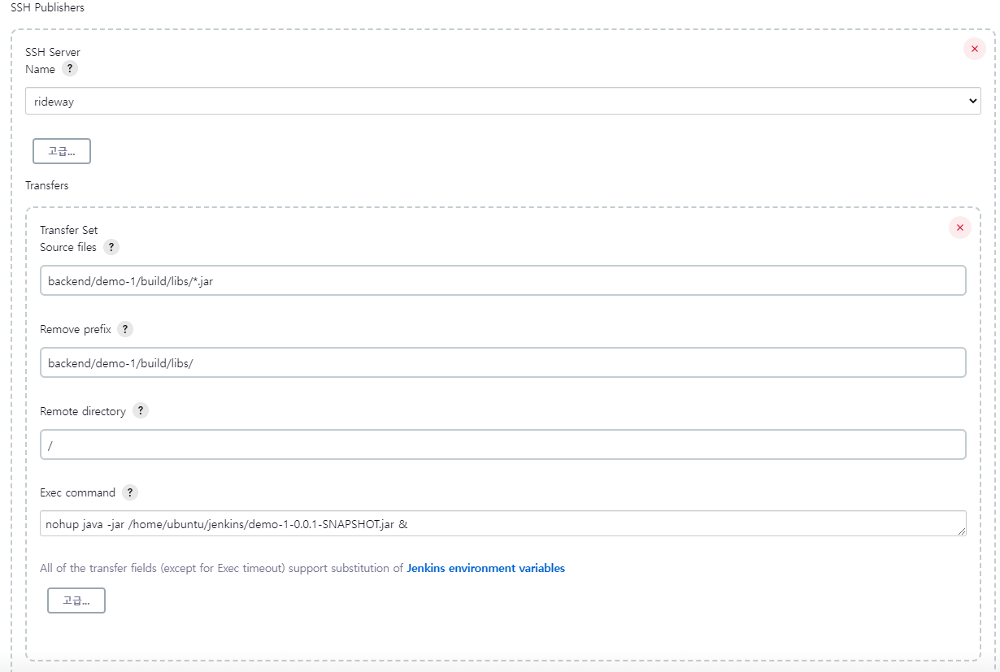
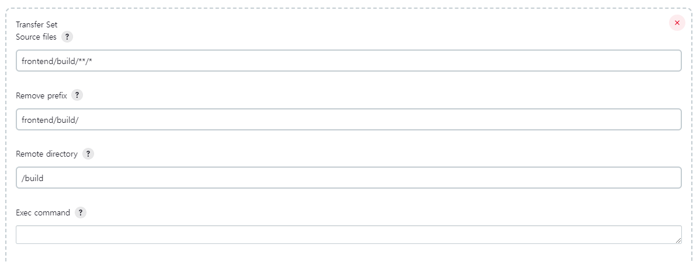
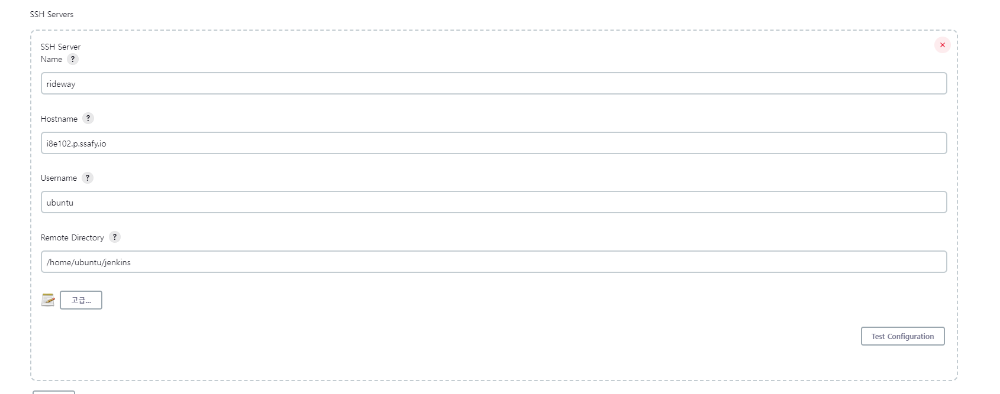
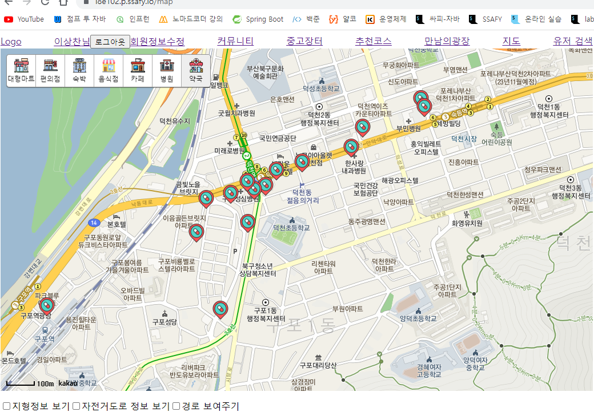

# 젠킨스 연결 진행, 배포 오류 수정, HTTPS 적용

## ✔ 배포

- ```
  sudo
  ```

   를 활용할 경우 권한이 

  ```
  root
  ```

   로 되기 때문에 주의해야한다.

  - `root` 권한이 되면 읽거나 쓰기가 힘들어진다. ⛔주의!

- 파일 경로도 유심히 살펴봐야 한다.

  - `Jenkins` 의 기본 경로일 수도 있고,
  - `ubuntu` 의 기본 경로일 수 있기 때문에 분류를 잘해야 한다.
  - 젠킨스 설정이나 파일 경로 설정 시 확인 필요

- 백엔드에서 

  ```
  Log4j2
  ```

   에 대한 설정이 잘못되어 있어서 배포 시 로그가 제대로 읽히지 않았다.

  - `controller` 영역 즉, 작업 공간에 대한 로거가 지정되지 않았다
  - `Log4j2` 에 대한 환경 설정 또한 제대로 이루어지지 않음

```jsx
<Loggers>
			// 여기 부분이 제대로 작성되지 않았음 //////
        <logger name="com.example.demo" level="DEBUG" additivity="false" >
            <AppenderRef ref="console" />
            <AppenderRef ref="file" />
        </logger>
			//////////////////////////////////////////
        <logger name="org.springframework" level="DEBUG" additivity="false" >
            <AppenderRef ref="console" />
            <AppenderRef ref="file" />
        </logger>

        <!-- sql binding variables logging -->
        <logger name="org.hibernate.type.descriptor.sql.BasicBinder" level="TRACE" additivity="false">
            <AppenderRef ref="console" />
            <AppenderRef ref="file" />
        </logger>

        <!-- sql logging -->
        <logger name="org.hibernate.SQL" level="DEBUG" additivity="false" >
            <AppenderRef ref="console" />
            <AppenderRef ref="file" />
        </logger>

        <!-- ROOT logger-->
        <Root level="ERROR">
            <AppenderRef ref="console" />
            <AppenderRef ref="file" />
        </Root>
    </Loggers>
# test_schema \\uBD80\\uBD84 -> db \\uC2A4\\uD0A4\\uB9C8
spring.datasource.driver-class-name=com.mysql.cj.jdbc.Driver
spring.datasource.url=jdbc:mysql://172.26.6.80:3306/rideway?useUniCode=yes&characterEncoding=UTF-8&serverTimezone=Asia/Seoul

# mysql \\uACC4\\uC815 id & \\uBE44\\uBC00\\uBC88\\uD638 \\uC785\\uB825
spring.datasource.username=B6
spring.datasource.password=!wlgk6cmd!

# JPA Settings
spring.jpa.hibernate.ddl-auto=none
spring.jpa.generate-ddl=false
spring.jpa.show-sql=true
spring.jpa.database=mysql
spring.jpa.database-platform=org.hibernate.dialect.MySQL5InnoDBDialect
spring.jpa.properties.hibernate.format_sql=true
spring.jpa.properties.hibernate.show_sql=false
logging.level.org.hibernate.SQL=debug
logging.level.org.hibernate.type=trace

# hibernate loggin
#loggin.level.org.hibernate=info

# email \\uC804\\uC1A1 \\uAD00\\uB828
spring.mail.host=smtp.naver.com
spring.mail.port=465
spring.mail.username=ridingmaster01@naver.com
spring.mail.password=1q2w3e4r!
spring.mail.properties.debug=true
spring.mail.properties.mail.smtp.auth=true
spring.mail.properties.mail.smtp.ssl.enable= true
spring.mail.properties.mail.smtp.starttls.enable=true
spring.mail.properties.mail.smtp.ssl.trust=smtp.naver.com

spring.mvc.view.prefix=/WEB-INF/views/
spring.mvc.view.suffix=.jsp

# 웹소켓 개발용
spring.devtools.livereload.enabled=true
spring.devtools.restart.enabled=false

// 아랫부분의 환경 설정이 작성되지 못함
# log4j
logging.config=classpath:log4j2.xml

# https \\uC124\\uC815
// 아래 log관련 로직을 활용해 로그가 작동하는지 확인함
package com.example.demo.controller;

import org.springframework.stereotype.Controller;
import org.springframework.web.bind.annotation.RequestMapping;
import lombok.extern.log4j.Log4j2;

import org.apache.logging.log4j.LogManager;
import org.apache.logging.log4j.Logger;

@Controller
@Log4j2
public class testController {

	@RequestMapping(value = "/api/test")
	public String test() {

		System.out.println("연결되었습니다!!!");
		log.debug("연결되었습니다!");

		return "test";
	}

}
```

- `sudo kill -9 입력값` 을 통해 현재 실행되고 있는 프로그램을 끌 수 있다.
- `tail -200f log.log` 는 로그의 현재 진행되는 현황을 계속 관찰해준다
- `rm -rf 파일명` 은 파일 삭제할 시 사용
- `ps -ef | grep java` 자바가 사용되는지 확인할 때 사용
- `sudo netstat -ltup` 현재 사용하고 있는 포트에 대해 알려준다
- `fuser -k 8080/tcp` 를 활용해서 현재 사용되는 포트를 꺼준다.


- NodeJS를 사용하기 위해서 해당 내용 체크해준다.

### ✅Build Steps

- Jenkins에게 파일을 지울 권한을 주어야 한다.
  - https://hyunmin1906.tistory.com/282
- 미리 기존 파일들을 지우고 빌드를 진행하자.

```jsx
sudo rm -rf /home/ubuntu/jenkins/build/*
cd /var/lib/jenkins/workspace/rideway/frontend
npm install --legacy-peer-deps
CI=false
npm run build

sudo rm -rf /home/ubuntu/jenkins/demo-1-0.0.1-SNAPSHOT.jar
export JAVA_HOME=/usr/lib/jvm/java-11-openjdk-amd64
export PATH="$PATH:$JAVA_HOME/bin"
cd /var/lib/jenkins/workspace/rideway/backend/demo-1
chmod +x ./gradlew
./gradlew clean bootJar
```

```jsx
rm -rf /home/ubuntu/jenkins/build/*
cp -R /var/lib/jenkins/workspace/rideway/frontend/build/* /home/ubuntu/jenkins/build/

rm -rf /home/ubuntu/jenkins/demo-1-0.0.1-SNAPSHOT.jar
cp -R /var/lib/jenkins/workspace/rideway/backend/demo-1/build/libs/*.jar /home/ubuntu/jenkins/
nohup java -jar /home/ubuntu/jenkins/demo-1-0.0.1-SNAPSHOT.jar &
```

- 프런트와 백이 빌드했을 때 폴더를 가져와서 실행시킨다.
- SSH Publisher를 사용하려고 했으나 동작하지 않음 → 추후 확인 필요!!!📌 -> 경로가 잘못되어 있었다 해결완료(✅)
  - ubuntu 계정의 경로가 아닌 jenkins에 설정해준 Remote Directory가 상대경로의 기준이었다.





- 기준




### KAKAO MAP API

- `.env` 파일은 `github`에 올라가지 않기 때문에 EC2에 따로 `.env`파일을 만들고 복사해서 넣어주고 빌드해주는 방식으로 변경하였다.



> 잘 작동한다.