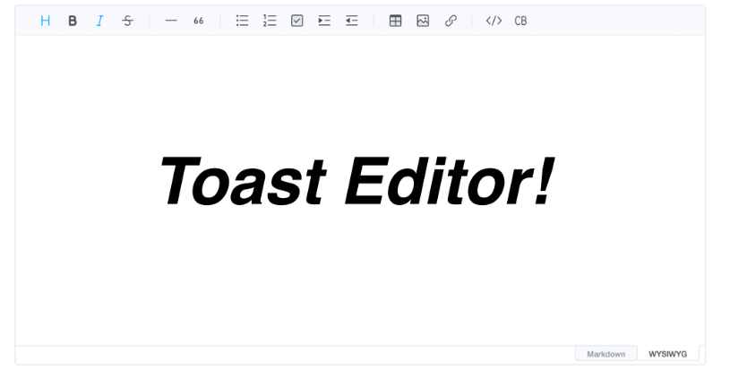
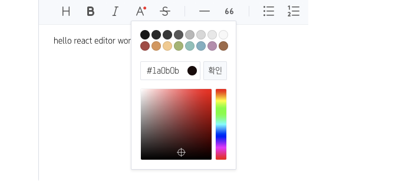
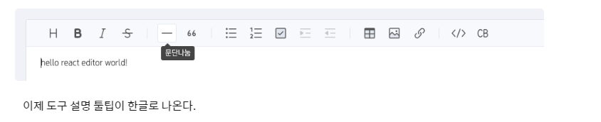
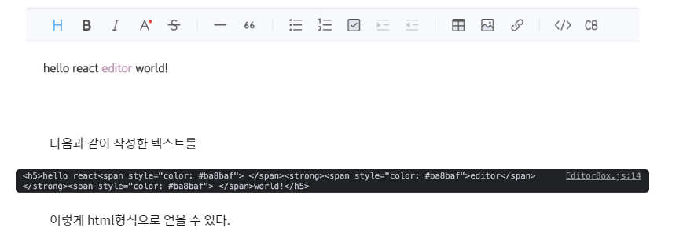
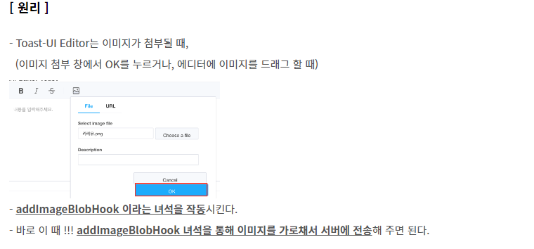
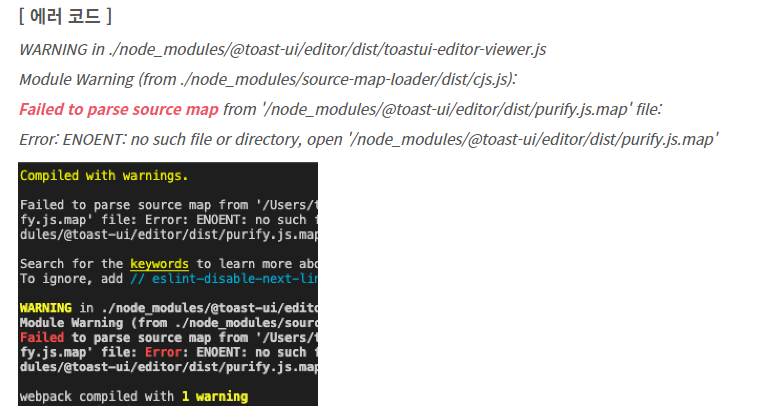
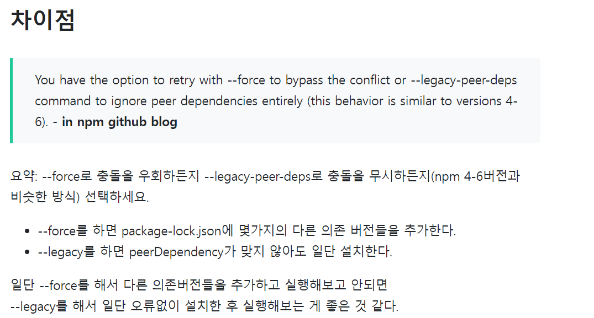
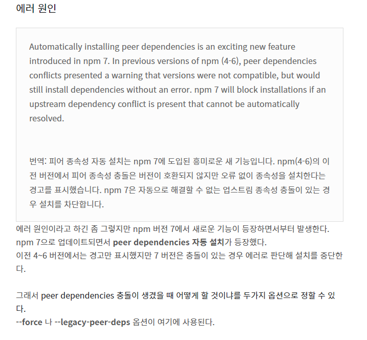
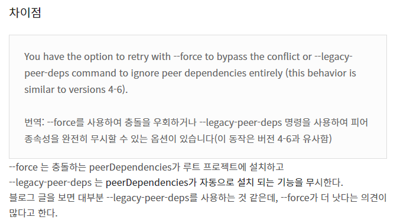

# TOAST UI Editor

> `ckeditor5`를 활용하려고 했으나 `webpack`에 대한 다양한 설정과 그 후의 처리 작업들에서 많은 버그가 발생해서 결국 구현하지 못했다. 여러 `Editor` 중에서 나름 구현이 간편하고 깔끔하게 `UI` 가 구성되어 있는 `TOAST UI Editor`를 선택했다.



### 📋설치

```js
npm install --save @toast-ui/react-editor
```

> 공식문서: https://github.com/nhn/tui.editor/tree/master/apps/react-editor#-usage


- `css`와 `Editor`를 임포트 한다.

```js
import '@toast-ui/editor/dist/toastui-editor.css';

import { Editor } from '@toast-ui/react-editor';
```


- 기본적인 에디터의 구성은 아래와 같다.
  - `initialEditType="wysiwyg"`를 통해 마크업과 위직스 중에 무엇을 사용할지 선택!

```js
import '@toast-ui/editor/dist/toastui-editor.css';

import { Editor } from '@toast-ui/react-editor';

const MyComponent = () => (
  <Editor
    initialValue="hello react editor world!"
    previewStyle="vertical"
    height="600px"
    initialEditType="markdown"
    useCommandShortcut={true}
  />
);
```


- 플러그인 추가(color picker)
  - 새로운 라이브러리를 다운받아서 사용해야 한다.

```js
npm install @toast-ui/editor-plugin-color-syntax
```


- `import`진행

```js
import colorSyntax from '@toast-ui/editor-plugin-color-syntax';
import 'tui-color-picker/dist/tui-color-picker.css';
import '@toast-ui/editor-plugin-color-syntax/dist/toastui-editor-plugin-color-syntax.css';
```

```js
<Editor
        initialValue="hello react editor world!"
        previewStyle="vertical"
        height="600px"
        initialEditType="wysiwyg"
        useCommandShortcut={false}
        plugins={[colorSyntax]}
      />
```




- 언어 설정
  - 기본 언어가 영어로 되어 있기 때문에 한국어로 바꿔주어야 한다.

```js
import '@toast-ui/editor/dist/i18n/ko-kr';
```

```js
function EditorBox() {
  return (
    <div className="edit_wrap">
      <Editor
        initialValue="hello react editor world!"
        previewStyle="vertical"
        height="600px"
        initialEditType="wysiwyg"
        useCommandShortcut={false}
                plugins={[colorSyntax]}
        language="ko-KR"
      />
    </div>
  );
}

export default EditorBox;
```




- Ref 설정
  - 작성한 텍스트를 가져오기 위해서는 인스턴스에서 메서드를 호출해야한다.
  - 아래와 같이 작성해서 텍스트를 가져온다.
    - `html`형식은 `getHTML()`사용
    - `markdown`은 `getMarkdown()`사용

```js
function App() {
  const editorRef = useRef();
  const onChange = () => {
    const data = editorRef.current.getInstance().getHTML();
    console.log(data);
  };
    return (
    <div>
      <Editor
        initialValue="hello react editor world!"
        previewStyle="vertical"
        height="600px"
        initialEditType="wysiwyg"
        useCommandShortcut={true}
        plugins={[colorSyntax]}
        language="ko-KR"
        ref={editorRef}
        onChange={onChange}
      />
	</div>
  );
}
```




- `Viewer`를 설정해서 작성한 텍스트를 볼 수 있게 된다.

```js
import React from 'react';
import "@toast-ui/editor/dist/toastui-editor-viewer.css";
import { Viewer } from "@toast-ui/react-editor";

function App() {
  const content = '<h3> html 헤더 <span style="color:blue;">파란색</span></h3>';
  return (
    <div>
      <Viewer initialValue={content} />
    </div>
  );
}

export default App;

```


- 이미지 첨부하기
  - 기본적으로 `base64`로 인콘딩해준다.
  - 이때 우리가 원하는 것은 이미지 파일은 서버로 전송하고, 파일이 저장된 경로만 DB에 저장해두는 것이다.



#### **[ addImageBlobHook 이란? ]**

**=> 첨부된 이미지를 File객체로 받고, img 태그의 src 와 alt 속성을 설정해 화면에 표시하는 역할을 한다.**

\- 상세한 구조는 아래와 같다.

```js
type HookCallback = (url: string, text?: string) => void;

export type HookMap = {
  addImageBlobHook?: (blob: Blob | File, callback: HookCallback) => void;
};
```

> 즉, **addImageBlobHook(blob, callback)** 형태를 가진다.

 

**1. blob:** 첨부된 이미지를 File 객체 형태로 받는다.

**2. callback(url, string):** img 태그를 만들어 화면에 이미지를 표시한다.

 \- 인자로 받은 url(이미지 경로)를 img태그의 src에 주입하고, text인자로 받은 값은 alt에 주입한다.


- addImageBlobHook의 디폴트 동작 방식

1) blob인자로 받은 첨부 이미지를  base64 인코딩한다.

2) 콜백함수를 호출시키면서 img 태그의 src에 인코딩된 이미지 데이터를 주입하고,

3) 아래의 description으로 입력받은 text를 alt에 주입한다.

4) 완성된 img태그를 화면에 삽입하여 표시한다.

#### **[ addImageBlobHook 사용 방법 ]** 

\- blob인자로 입력받은 첨부 파일을 서버로 전송하고,

\- callback 함수를 호출시켜 img 태그의 src, alt 속성을 설정해 화면에 표시해주면 된다.

\- 이를 위해 **Editor 컴포넌트의 hooks 프롭에서 addImageBlobHook을 설정**해주면 된다.

```js
import { useRef } from 'react';

// Toast 에디터
import { Editor } from '@toast-ui/react-editor';
import '@toast-ui/editor/dist/toastui-editor.css';

export default function ToastEditor() {
  // Editor DOM
  const editorRef = useRef();

  return (
    <div>
      <Editor
        ref={editorRef}
        placeholder="내용을 입력해주세요."
        previewStyle="vertical"
        height="300px"
        initialEditType="wysiwyg"
        toolbarItems={[['bold', 'italic', 'strike'], ['image']]}
        
        // hooks 에서 addImageBlobHook 를 주물러 주면 된다.
        hooks={{
          addImageBlobHook: async (blob, callback) => {
            
            console.log(blob);  // File {name: '카레유.png', ... }

            // 1. 첨부된 이미지 파일을 서버로 전송후, 이미지 경로 url을 받아온다.
            // const imgUrl = await .... 서버 전송 / 경로 수신 코드 ...

            // 2. 첨부된 이미지를 화면에 표시(경로는 임의로 넣었다.)
            callback('http://localhost:5000/img/카레유.png', '카레유');
          }
        }}
      ></Editor>
    </div>
  );
}
```

```js
import "@toast-ui/editor/dist/toastui-editor.css";

import { Editor } from "@toast-ui/react-editor";
import colorSyntax from "@toast-ui/editor-plugin-color-syntax";
import "tui-color-picker/dist/tui-color-picker.css";
import "@toast-ui/editor-plugin-color-syntax/dist/toastui-editor-plugin-color-syntax.css";
import "@toast-ui/editor/dist/i18n/ko-kr";
import { useRef } from "react";
import "@toast-ui/editor/dist/toastui-editor-viewer.css";
import { Viewer } from "@toast-ui/react-editor";
import axios from "axios";

function App() {
  const editorRef = useRef();
  const onChange = () => {
    const data = editorRef.current.getInstance().getHTML();
    console.log(data);
  };
  const content = '<h3> html 헤더 <span style="color:blue;">파란색</span></h3>';
  return (
    <div>
      <Editor
        initialValue="hello react editor world!"
        previewStyle="vertical"
        height="600px"
        initialEditType="wysiwyg"
        useCommandShortcut={true}
        plugins={[colorSyntax]}
        language="ko-KR"
        ref={editorRef}
        onChange={onChange}
        hooks={{
          addImageBlobHook: async (blob, callback) => {
            console.log(blob);
            const formData = new FormData();
            formData.append("file", blob);
            const response = await axios.post("/api/upload", formData);
            console.log(response);
          },
        }}
      />
      <Viewer initialValue={content} />
    </div>
  );
}

export default App;
```


### 📌오류 사항




- npm 설치 시 충돌





