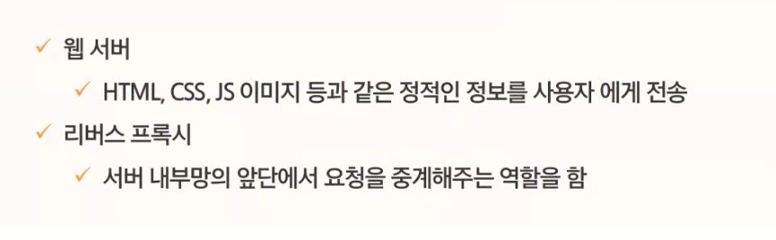
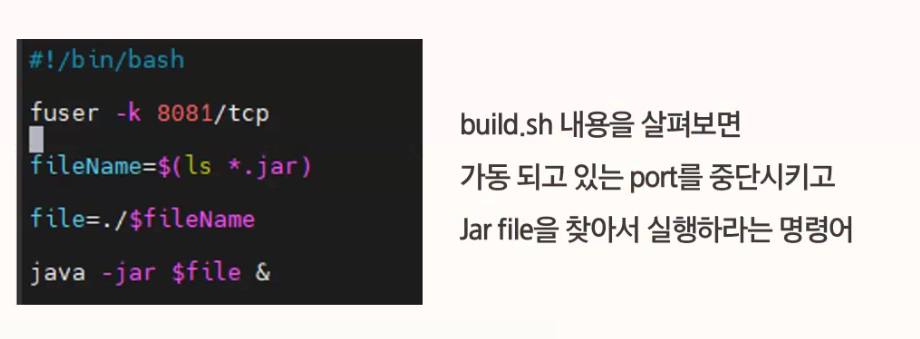
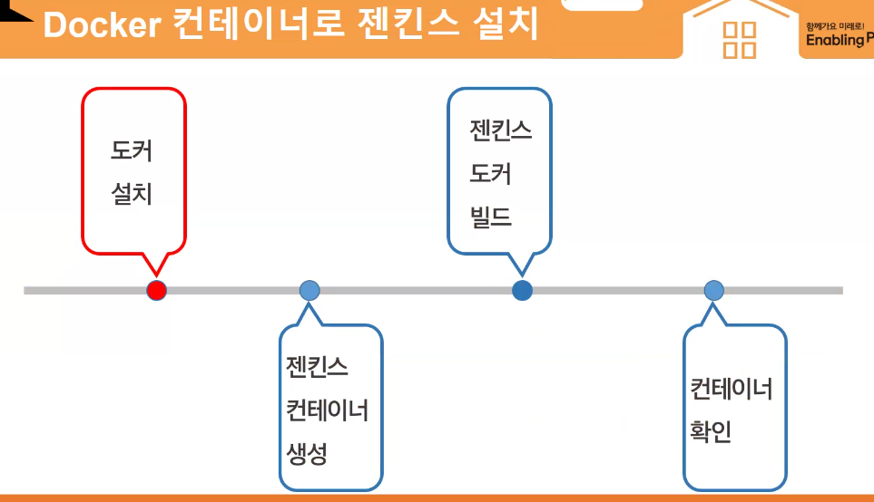

# 배포

> 서울과 일산에 AWS가 이씀

### UFW 방화벽

> 요청에 맞춰서 계속 프로세스를 만듦

> 사용자의 요청에 따라 처리해줌

> 클라이언트의 요청을 중간 웹서버에서 분배가 가능

> 도커 위에서 설정을 넣어서 진행함

---

### 동준 코치님

- Ubuntu로 배포 기초환경 구축하기

- UFW Install & setting

> 안에 인증키가 있어야 함

> 

> update 최신화된 페키지 불러옴, upgrade 최신화된 적용 업데이트

> 포트 변경하기

> 젠킨스 플러그인 설치하기

remote directory -> 실제 있는 폴더 적기

> 권한을 부여하고 실행한다, bootJar plainjar를 생성하지 않음

> nohup 젠킨스가 끊어져도 계속동작하는 명령어 

# Docker로 배포하기

> 가상 머신을 설치해서 앱을 띄운다, 한개의 OS이지만 컨테이너에 있어서 독립적으로 사용할 수 있다. 각 컨테이너가 커널을 공유해서 효율적으로 할 수 있음.

> 다른 곳에서도 똑같은 환경에서 구동이 될 수 있게 된다.

> 사용자가 제어하지 않고 백그라운드에서 사용 (DinD) -> 보안 측면 문제 -> 컨테이너에 막강한 권한이 있어서, 이미지 캐쉬를 공유하지 않음

> 도커에서 도커를 호출하기 위해 볼륨 설정

# 쿠버네티스

