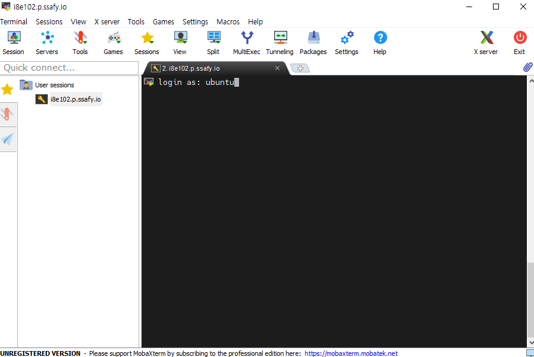

# 배포 진행 사항

### ✨ 배포 URL

🎉 http://i8e102.p.ssafy.io/

- 현재는 기본 기능만 구성되어 있어 CSS작업이 되어있지 않습니다.


- 백엔드는 `10080`포트를 사용 중이며, 프런트엔드는 `80` 포트를 사용 중입니다.
  - `SpringBoot`포트도 `10080`으로 조정 완료.
- `SpringBoot`는 `jdk11`버전을 사용하고 있으며, `React`는 `node: 16.15.0`버전을 사용 중입니다.


### 📢 배운 사항

✅ `GitLab`, `docker`, `Jenkins`, `Nginx`, `EC2`의 기본적인 동작 원리를 익혔다.

✅ `CI/CD` 배포를 구축하는 것은 개발 기간을 단축시키고 개발 효율을 증가시킨다.

✅ `local`과 달리 배포를 하는 과정이나 후에 예상치 못한 오류가 발생하기 때문에 미리 확인이 필요하다.

✅ 리눅스에 대한 기본적인 명령어를 학습함. (`cd`, `ls`, `dir` 등등)

✅ 배포를 겁낼 필요가 전혀 없다. 팀원과 코치님, 그리고 훌륭하신 컨설턴트님이 계시기 때문이다.


### ⛔ 에러 맛보기

❌ `Docker`파일 생성 시 대/소문자를 모두 구분하기 때문에 이름을 반드시 `Dockerfile`로 지정해야 한다. -> `DockerFile`로 생성해서 `Jenkins`가 인식하지 못 했다.

❌ 배포 시 백엔드의 포트는 `10080`번을 사용하였다. 그렇지만 `Spring Boot`에서는 기본값인 `8080`포트로 접속을 하게 설계되어 있어 이 부분을 맞춰 주어야 했다. -> 서버에는 백엔드가 올라갔지만 계속 연결되지 않는 상황이 지속되었다.

❌ 공용 IP, 서버 내부 로컬 IP, 파일명 등을 유심히 고려해서 명령어를 입력해야 한다. -> 잘못된 IP주소나 파일명을 사용하여 곤혹을 치뤘다.


### 📋 배포 규칙

- `CI/CD`를 통한 자동 배포를 진행하기 때문에 규칙이 반드시 필요하다.
  - 모든 개발은 우선적으로 `develop` 브랜치에서 진행한다.
  - 어느 정도 개발이 되면 `Merge` 후 로컬 상태에서 충분한 테스트를 건친 다음에 배포를 진행한다.


### 📌동작 원리 도식화


1. `Gitlab`에서 `push`를 진행하면 `Jenkins`의 `WebHook`에 의해 자동으로 빌드 진행
2. `Jenkins`에서 `React`, `Nginx`, `Spring Boot` 프로젝트 내부의 `Docker File`을 이용해서 `Docker build`를 진행한다.
3. `Jenkins`에서 컨테이너를 생성한다.

4. 외부에서 접속이 가능해진다.

---

### ⭐ CI/CD 배포 팁!!

> 본 내용 진행 시 개념에 대한 언급을 하면서 진행할 예정입니다. 해당 자료는 한진성 코치님의`https://github.com/hjs101/CICD_manual/tree/main/%EB%A7%A4%EB%89%B4%EC%96%BC%20v2` 자료를 토대로 작성되었습니다.

- `CI/CD` 설치 메뉴얼은 위 링크에 상세하게 표기되어 있습니다.
- 아래 사항은 진행 시 어려웠던 점이나 필요한 정보들을 제공하고 있습니다.

---

### ✔MobaXterm 설치(Tool)

- 해당 툴을 활용해서 윈도우 환경에서도 `Linux`를 편하게 사용할 수 있다. 인증키를 통해 `EC2`서버에 접속하여 사용이 가능하다.
  - 다운로드 후 파일을 실행시킨다
  - `Session`영역의 `SSH`탭으로 들어간다.
  - `Basic SSH settings`부분에 `Server`주소를 입력한다.
  - `Use private key`에는 우리가 받은 `pem` 인증키를 넣어준다.


- `ubuntu`라고 작성해줍니다.



- 서버 도착 완료!!!


> 📢 리눅스에 대한 기본 명령어를 공부해두면 좋습니다.

- 젠킨스 `bash shell` 접근 명령어

```
sudo docker exec -it jenkins bash
```

- 백엔드/프런트엔드 로그 확인 메시지(`backimg`는 내가 설정한 백엔드 이름이다.)

```
sudo docker logs backimg
sudo docker logs frontimg
```


> 톰캣은 도커 내부에서 실행중인 듯 보인다.

- 도커 현황 보기

```
ps -ef | grep docker
```


### ✔ Webhook 설정

- `URL` 기입 시 `http://배포서버공인IP:9090/project/생성한jenkins프로젝트이름/`을 기입해줍니다.
  - `/project/프로젝트 이름`부분을 서버의 URL로 복사해서 넣었더니 오류가 발생했었습니다.


### ✔ 프로젝트 내부에 Dockerfile 작성

- 백엔드, 프런트 엔드 폴더 내부에서 `git bash` 실행 후 `touch Dockerfile`로 빈 파일을 만들어줍니다. `VSCode`로 해당 파일을 열어 아래와 같이 내용을 입력해줍니다. 단 경로 같은 경우는 우리가 만들어준 `Jenkins`의 경로를 알아보고 바꿔서 작성해야 합니다.


### ✔ 젠킨스 프로젝트 빌드 스탭 설정

- 빨간 박스 부분은 우리가 설정한 프로젝트 경로를 넣어주어야 합니다.


### ✔ Ninx.conf 파일 설정 시

- `backend`의 서버 부분은 로컬로 설정된 IP를 입력해야합니다.


- `ip addr | grep "inet"`을 입력해서 `inet`만 보이도록 할 수 있다.


- ufw 설정 필요 - 보안!