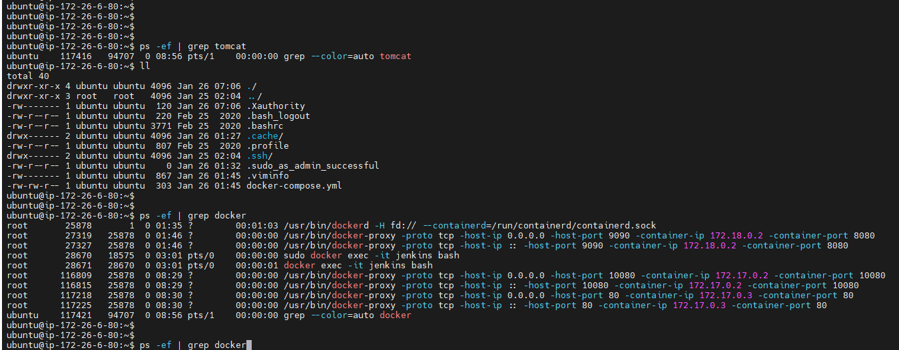

# 서버 배포

- 우선 참고 자료는 해당 CI/CI 게시글을 보고 따라했다.

- https://github.com/hjs101/CICD_manual/tree/main/%EB%A7%A4%EB%89%B4%EC%96%BC%20v2


### ✏ MobaXterm는 외부 서버에서 접근할 수 있도록 해준다.


- 도커 같은 경우 `Dockerfile`파일 명의 대/소문자를 구분해서 작성해야한다.


```
sudo docker logs backimg

sudo docker logs frontimg

sudo apt install net-tools
-> ifconfig를 할 수 있게 해줌

ps -ef | grep docker

ps -ef | grep tomcat

netstat
```





